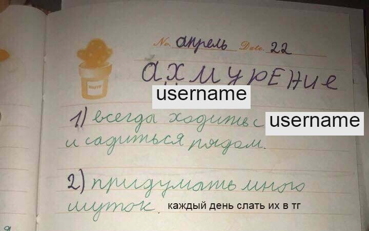

# memes4crush
Automatizes small routine steps towards success. 💪👧

## About

It sends one picture from ur saved favourites to ur passion or anyone else every day.

__P.S.__: Silly pet project just for fun. However, could be used someday.

## Howto
Change configs in `.env` or `config.py` file, then run `python.exe main.py`.

Note:
- you'll need __api_id__ and __api_hash__, see [here](https://core.telegram.org/api/obtaining_api_id);
- you'll need enter a __confirmation code__ first time;
- __chat_id__ can be replaced by __username__;
- an image from the pool is __deleted__ after it was sent.
