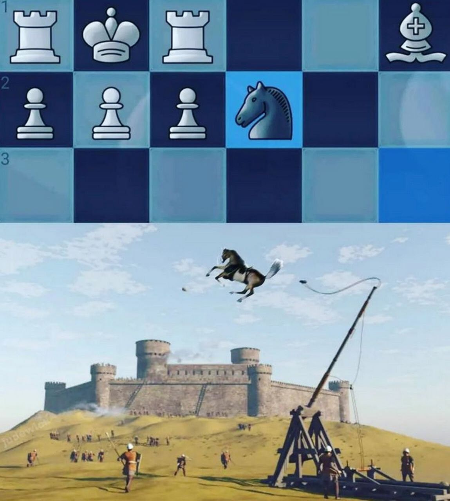
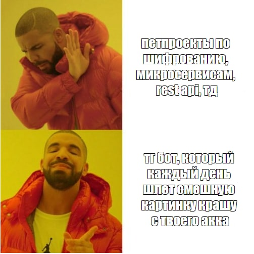

# memes4crush
Поставь на крон рутинные шаги к успеху. 💪👧

## About

Взаимодейтсвует с Telegram API в качестве юзера и отправляет одно изображение из локальных "сохранялок" объекту вашей страсти или кому-либо ещё с заданной периодичностью.

__P.S.__: Pet-проект забавы ради. Хотя может и пригодится когда-нибудь.

## Howto

Задать переменные в `.env` или `config.py` файле, затем запустить `python.exe main.py`.

Примечания:
- вам понадобятся __api_id__ и __api_hash__, см. подробнее [здесь](https://core.telegram.org/api/obtaining_api_id);
- необходимо ввести __код подтверждения__ при первом запуске сессии;
- __chat_id__ может быть изменён на __username__;
- картинка будет __удалена__ из пула после отправки.

## To-Do

- [ ] Деплой на сервере / запуск в serverless облаке;
- [ ] Возможность делать рассылку нескольким юзерам (опционально: из разных пулов).
